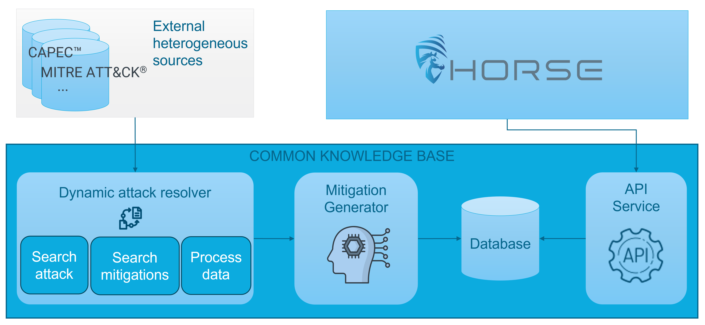
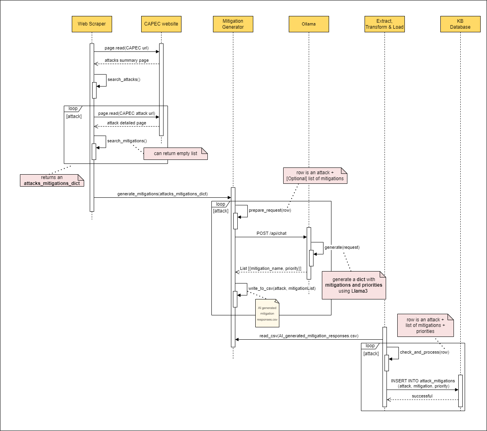

# 🛡️ HORSE-GenAI-CKB: Generative AI to enhance the Common Knowledge Base in the HORSE project

## 📚 Table of Contents
- [📖 Project Overview](#-project-overview)
- [🤖 Generative AI](#-generative-ai)
- [🛠️ Architecture](#-architecture)
  - [System Architecture](#-system-architecture)
  - [Sequential Diagram](#-sequential-diagram)
- [🚀 Getting Started](#-getting-started)
  - [Prerequisites](#-prerequisites)
  - [Installation](#-installation)
  - [Usage](#-usage)
- [🧩 Components](#-components)
  - [WebScraper](#-webscraper)
  - [MitigationGenerator](#-mitigationgenerator)
  - [Extract, Transform, Load (ETL)](#-extract-transform-load-etl)
- [📜 License](#-license)
- [📌Acknowledgement](#acknowledgement)

## 📖 Project Overview

**Common Attack Knowledge Base Enhancer** is a tool designed to leverage generative AI for improving cybersecurity knowledge bases. It automates the extraction, enrichment, and prioritization of security mitigations to enhance threat intelligence.

It starts by automatically gathering attack patterns and mitigations from the [Common Attack Pattern Enumeration and Classification (CAPEC)](https://capec.mitre.org/). This data is then enriched by augmenting the mitigations with additional information and assigning priority levels using a Large Language Model (LLM).

## 🤖 Generative AI

Generative AI plays a crucial role in enhancing the CAPEC Knowledge Base by generating new mitigation strategies and assigning priority levels. This technology is used to generate new mitigation strategies based on the existing data and to refine and expand upon the retrieved mitigations. The AI also evaluates and assigns priority levels to these mitigations, ensuring that the most effective strategies are highlighted.

For running large language models (LLMs), we primarily used the [Ollama API](https://ollama.com) for models that can run locally. For proprietary models not hosted on Ollama, such as Claude, we accessed them via their respective APIs.

To ensure the quality of the generated mitigations, we implemented an LLM-as-a-Judge approach, where separate powerful LLMs evaluate the generated responses. This evaluation process helps determine the relevance, accuracy and correctness of the format of the responses, further improving the reliability of the enhanced Knowledge Base.

The generated responses are stored in the `output` folder, and the evaluations are located in the `evaluation/LLMs` folder. Analysis notebooks, including visualizations such as plots, are available in the `evaluation/notebooks` folder.

### List of Other Models Used:

- **Claude 3.5 Sonnet**: The version used was released by Anthropic on October 22, 2024. This model specializes in advanced language understanding and generation. We accessed it via Anthropic’s API. For more details, visit their [official page](https://www.anthropic.com/news/3-5-models-and-computer-use).

- **DeepSeek R1 8B**: This model is designed to enhance reasoning performance, achieving results comparable to OpenAI-o1 across math, code, and reasoning tasks. It is available through Ollama. For more details, refer to the [DeepSeek R1 official documentation](https://github.com/deepseek-ai/DeepSeek-R1).

- **Granite 3.0 8B**: Developed by IBM, this model is tailored for enterprise use cases, offering state-of-the-art capabilities for business applications. It is available through Ollama. More information can be found on IBM’s [announcement page](https://www.ibm.com/new/ibm-granite-3-0-open-state-of-the-art-enterprise-models).

- **Llama 3.1 8B**: This is the first openly available model demonstrating state-of-the-art capabilities comparable to leading AI models in general knowledge, steerability, math, tool use, and multilingual translation. For further details, refer to the [official Llama 3.1 announcement](https://ai.meta.com/blog/meta-llama-3-1/).

- **Llama 2 13B**: Also released by Meta, this 13-billion-parameter model demonstrates superior capabilities compared to the 7B version on various public benchmarks. It was accessed through Ollama. Visit Meta’s [Llama 2 page](https://www.llama.com/llama2) for more information.

- **Llama 2 7B**: Released by Meta, this 7-billion-parameter model is part of the Llama 2 family, designed for versatility and efficiency in language tasks. It was accessed via Ollama. Further details are available on Meta’s [Llama 2 page](https://www.llama.com/llama2).

- **ALIENTELLIGENCE-cyberaisecurity**: Based on Llama 3 (8B version, April 18, 2024), this model incorporates enhancements to specialize in cybersecurity contexts by assigning it a specific identity, asking it to act as a cybersecurity expert. This model is available on Ollama. Learn more on its [Ollama page](https://ollama.com/ALIENTELLIGENCE/cyberaisecurity).


## 🛠️ Architecture

### System Architecture

The architecture of this project is divided into three main components:

* **Centralized Database**: A data storage system providing secure and efficient management of attack and mitigation data, optimized for fast retrieval and future expansion.
* **Dynamic Attack Resolver**: A set of Python modules that aggregate diverse data sources to detect new attacks and, eventually, their corresponding mitigations, coupled with a pipeline to transform the data for LLM consumption.
* **Mitigation Generator**: A Python module leveraging generative AI to enrich attack and mitigation data, producing a suite of attack-mitigation pairs and their optimal execution order, called priority.
* **API service**: A RESTful API enabling communication with external modules.



### Sequence Diagram

The sequence diagram below illustrates the interaction between the different components:



## 🚀 Getting Started

### Prerequisites

Before you begin, ensure you have met the following requirements:

- Python 3.12.2
- Required Python packages (listed in `requirements.txt`)
- Access to the CAPEC website
- Docker

### Installation

1. **Clone the repository:**

    ```bash
    git clone https://github.com/martel-innovate/HORSE-GenAI-CKB.git 
    cd HORSE-GenAI-CKB
    ```

2. **Install the necessary dependencies:**
    ```bash
    pip install -r requirements.txt
    ```

3. **Set up your database:**
    <p id=database>⚠️ This is required for running the ETL pipeline.<p>
    Ensure that you have a PostgreSQL database running with the schema defined in the `init.sql` file. You can set up the database either manually or by using Docker Compose. To use Docker Compose follow:

- 3.1 **Create a `.env` File:**
   - Copy the example environment file:
     ```bash
     cp .env.example .env
     ```
   - Edit the `.env` file to include your database credentials.

- 3.2 **Start the Database:**
   - Run the following command to start the PostgreSQL container with Docker Compose:
     ```bash
     docker-compose up -d
     ```
   This will launch PostgreSQL and apply the schema from `init.sql`.

If you prefer to set up PostgreSQL manually, ensure that the database schema matches the structure defined in the `init.sql` file and configure your database credentials in the `.env` file according to the format provided in `.env.example`.

4. Set Up Ollama

To use generative AI for augmenting mitigations, you'll need to set up Ollama, which provides access to language models. Follow the steps below to get Ollama running with the Llama 3.1 model. To run another model, visit Ollama website.

- 4.1 **Download and Install Ollama**: Go to the [Ollama website](https://ollama.com/download) to download the Ollama CLI tool for your operating system. Follow the installation instructions provided to install Ollama on your machine.

- 4.2 **Download and Install Llama 3.1 Model**: After installing Ollama, open your terminal or command prompt and run the following command to download the Llama 3.1 model:
   ```bash
   ollama pull llama3.1
   ```
- 4.3 **Start Ollama server**: Before starting the server, make sure that Ollama is not already running in the background. Run the following command to start the Ollama server with the Llama 3.1 model:
    ```bash
   ollama serve
   ```

### Usage

1. **Generate mitigations using the MitigationGenerator**

- 1.1 **Run the scraper and generate mitigations**
    ```bash
    python src\scrape_and_generate.py
    ```

- 1.2 **Load `output\scraper\capec.csv` dataset and generate mitigations**
    ```bash
    python src\generate_from_csv.py
    ```

2. **Run the Extract, Transform, Load (ETL) process:**

    ⚠️ Be sure to have the Database running (see [Set up your Database](#database))
    ```bash
    python src\extract_transform_load.py
    ```

## 🧩 Components

### WebScraper

The **scraper** is responsible for retrieving attack patterns and associated mitigations from the CAPEC website. It navigates the site and extracts the required information. Additionally, the WebScraper checks whether each attack and mitigation is already listed in the `output/<<MODEL_NAME>>_ai_generated_mitigation_responses.csv` file. This ensures that only new, unprocessed content is scraped, thereby optimizing resource use and avoiding redundant content generation.

### MitigationGenerator

The **MitigationGenerator** uses generative AI to analyze the mitigations retrieved by the scraper and to augment this information by generating new mitigations or enhancing existing ones. The generator also assigns priority levels to the mitigations based on their effectiveness. Finally, the new and enhanced content is saved to the `output/<<MODEL_NAME>>_ai_generated_mitigation_responses.csv` file for further processing.

### Extract, Transform, Load (ETL)

The **ETL** component processes the output from the **MitigationGenerator**, transforming it into a format suitable for the **Common Knowledge Base**. It then loads this processed data into the database, ensuring that the information is structured and ready for querying.

## 📜 License

This project is licensed. See the [LICENSE](LICENSE) file for details.

### Data Attribution

This project utilizes attack patterns and mitigation data from the Common Attack Pattern Enumeration and Classification (CAPEC™) database, provided by The MITRE Corporation. 

> **Source:** [CAPEC Website](https://capec.mitre.org/)  
> **License:**  
> *The MITRE Corporation (MITRE) hereby grants you a non-exclusive, royalty-free license to use Common Attack Pattern Enumeration and Classification (CAPEC™) for research, development, and commercial purposes. Any copy you make for such purposes is authorized provided that you reproduce MITRE’s copyright designation and this license in any such copy.*  
>  
> **Disclaimer:**  
> *All documents and the information contained therein are provided "as is," without warranties of any kind. MITRE and its affiliates disclaim any express or implied warranties, including but not limited to warranties of merchantability or fitness for a particular purpose.*  

## 📌Acknowledgement

This repository is part of the [HORSE](https://github.com/HORSE-EU-Project) project. HORSE project has received funding from the Smart Networks and Services Joint Undertaking (SNS JU) under the European Union’s Horizon Europe research and innovation programme under Grant Agreement No 101096342. This work has received funding from the Swiss State Secretariat for Education, Research and Innovation (SERI). Views and opinions expressed are however those of the author(s) only and do not necessarily reflect those of the European Union. Neither the European Union nor the granting authority can be held responsible for them. For more details about the project, visit the [HORSE project website](https://www.horse-6g.eu/) or the [HORSE LinkedIn page](https://www.linkedin.com/company/horse-project-eu/).


 
